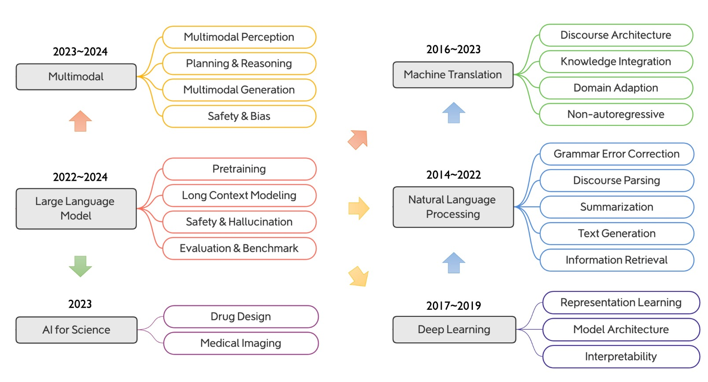

# About Me

Here is **Yong Dai (代勇)**. 

---

## Brief Bio
As a dedicated AI researcher, my work bridges the gap between large language models and the complex, multi-modal world we live in. My journey began at the University of Electronic Science and Technology of China (UESTC), where I completed my Ph.D. under the guidance of Professor Zenglin Xu. During my doctoral program, I also had the valuable opportunity to learn and grow as a research intern at Microsoft. This experience, combined with my subsequent role as a researcher at Tencent AI Lab, solidified my expertise in harnessing large-scale models for a wide spectrum of downstream tasks.

Recently, my focus has shifted to what I see as the next frontier: **multi-modality** and **web agents**. I am deeply fascinated by the pursuit of a unified paradigm—a single, elegant model that can perceive, reason, and create across text, images, and other data formats. My long-term vision is to contribute to the development of a true "World Model." By integrating such a powerful generative and understanding system with autonomous agent technology, I aim to play a part in building the foundation for **Artificial General Intelligence (AGI)** and creating systems that can truly benefit humanity.

---

## Experience

- 05/21 - 04/24: Research Intern and Researcher, Tencent AI Lab
- 11/20 - 04/21: Visiting student, Westlake University
- 09/19 - 10/20: Research Intern, Microsoft STCA nlpg
- 09/18 - 08/19: Project leader, cooperation project with Nuance

## Research Interests

## Project

- 
- 
- 

---

| year | content |
|------|---------|
| **Feb 2025** |  🎉 Paper accepted to ACM MM 2025 |
| **Nov 2024** |  Released paper *MME-finance*: A multimodal finance benchmark |
| **Oct 2024** |  Released paper *TimeCNN*: Refining Cross-Variable Interaction |
| **Sep 2024** |  🎉 Two papers accepted to NeurIPS 2024 |
| **Sep 2024** |  🎉 One paper accepted to EMNLP 2024 Findings |
| **Jun 2024** |  🎉 Three papers accepted to ACL 2024 |
| **Dec 2023** |  Released evaluation paper *TencentLLMEval* |
| **Dec 2023** |  Released reward adaptation paper *Everyone deserves a reward* |
| **Jun 2023** |  🎉 Paper *SkillNet-X* accepted to ICASSP 2024 |
| **Dec 2022** |  🎉 Paper *Federated Learning + PLMs* accepted to Findings of ACL 2023 |
| **Oct 2022** |  🎉 Paper *Prompt-based Constrained Clustering* accepted to Findings of EMNLP 2022 |
| **Aug 2022** |  Released technical report *Effidit: Your AI Writing Assistant* |
| **Aug 2022** |  Released paper *Chinese BERT Error Detection* |
| **Mar 2022** |  Released paper *MarkBERT* |
| **Mar 2022** |  🎉 Paper *Whole Word Masking* accepted to Findings of ACL 2022 |
| **Mar 2022** |  🎉 Paper *Chinese GPT for Pinyin Input* accepted to ACL 2022 |
| **Jan 2022** |  🎉 Paper *Graph Fusion Network* accepted to KBS |
| **Sep 2021** |  🎉 Paper *Unsupervised Sentiment Analysis* accepted to CC |
| **Oct 2020** |  🎉 Paper *Contextualize KBs with Transformer* accepted to EMNLP 2021 (Oral) |
| **Apr 2020** |  🎉 Paper *Adversarial Training for Sentiment Analysis* accepted to AAAI 2020 |

